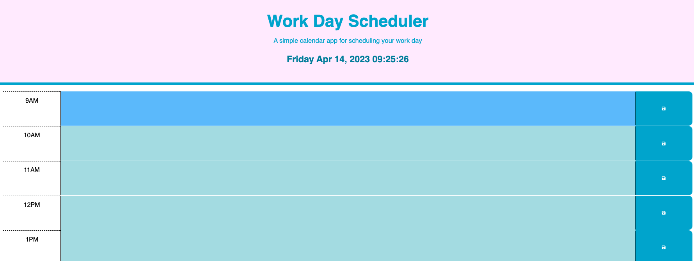
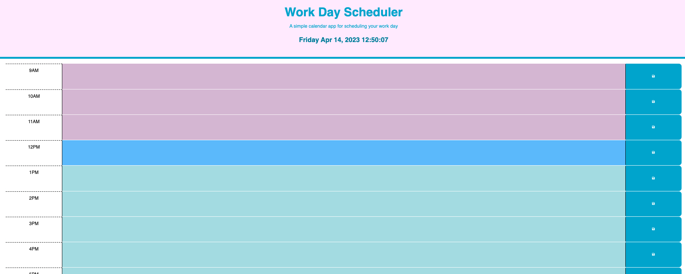

# Work-Day Calendar

## Description
I've created an interactive, color-coded calendar where you can save your events for the workday. The background colors change depending on whether the event is in the past (pink), present (blue), or future (green). 

Link to live page: https://lkrum.github.io/Work-Day-Scheduler/

## Installation
N/A

## Usage
Click into one of the table rows to log your events for the day. Click the save button on the right side to save your text input. The text will save on a page refresh.

## Credits 
I used Bootstrap, Jquery, and Day.js to make my application.

- [W3schools](https://www.w3schools.com/jsref/jsref_split.asp)
- [W3schools](https://developer.mozilla.org/en-US/docs/Web/JavaScript/Reference/Global_Objects/parseInt)
- [W3schools](https://www.w3schools.com/jquery/jquery_events.asp)
- [W3schools](https://www.w3schools.com/tags/tag_button.asp)
- [Jquery](https://api.jquery.com/attr/)
- Diem Ly, one of the class TAs, helped me write the formula for getting the save button to function.
- My classmates Emma Carr and Jessica Saddington also helped me with the save button and JQuery formatting.
- Patrick Lake, one of the bootcamp tutors, helped me come up with the method to retrieve my data from local storage and display it on the page.

## License
MIT License
