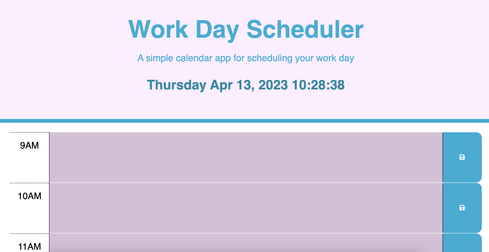

# Work-Day Calendar

## Description
I've created an interactive calendar where you can save your events. The colors of events change depending on the time of day. The background colors change depending on whether the event is in the past, present, for future. The color is pink for the past, blue for the present, and green for the future.

Link to live page: 

## Installation
N/A

## Usage
Click into one of the table rows to log your events for the day. Click the save button on the right side to save your text input.

## Credits 

- [W3schools](https://www.w3schools.com/jsref/met_loc_assign.asp
- [W3schools]https://www.w3schools.com/jsref/event_target.asp)
- [W3schools](https://www.w3schools.com/tags/tag_input.asp)
- [W3schools](https://www.w3schools.com/tags/tag_button.asp)
- Diem Ly, one of the class TAs, helped me write the formula for getting the save button to function.
- My classmates Emma Carr and Jessica Saddington also helped me with the save button, JQuery formatting, and the hour id for-loop.

## License
MIT License
